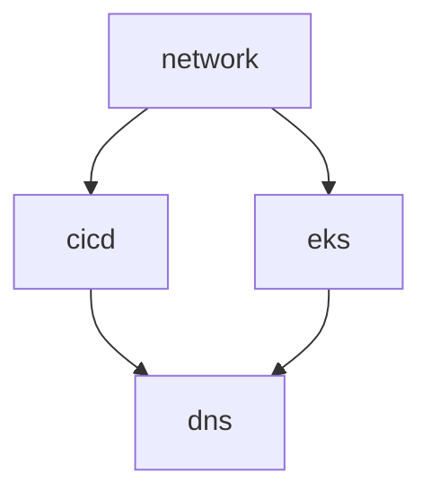

# 🏗️ AWS Infrastructure with Terraform

Multi-stack Terraform infrastructure for development and production environments.

## 📋 **Quick Start**

### **Prerequisites**
- Terraform ≥ 1.5
- AWS CLI v2 configured
- Access to S3 backend: `tfstate-inf-orinbar-euc1`

### **Deployment**
```bash
# Deploy all stacks in order
make apply STACK=network ENV=dev
make apply STACK=cicd ENV=dev  
make apply STACK=dns ENV=dev
make apply STACK=eks ENV=dev
```

### **Destroy**
```bash
# Destroy in reverse order
make destroy STACK=dns ENV=dev
make destroy STACK=eks ENV=dev
make destroy STACK=cicd ENV=dev
make destroy STACK=network ENV=dev
```

---

## 🏗️ **Stack Overview**

### **1. Network** (`envs/dev/network/`)
- VPC with public/private subnets
- Custom NAT instance (cost-optimized)
- SSM access configuration
- Security groups

### **2. CICD** (`envs/dev/cicd/`)
- GitLab server (version control)
- Jenkins server (build automation)
- Jenkins agents (ephemeral builders)
- SSM-only access (no public IPs)

### **3. DNS** (`envs/dev/dns/`)
- Route53 public zone (delegated from Cloudflare)
- Route53 private zone (`internal.local`)
- ACM certificate with DNS validation
- ExternalDNS IRSA role

### **4. EKS** (`envs/dev/eks/`)
- EKS cluster with managed node groups
- AWS Load Balancer Controller IRSA
- Public API (restricted IPs)
- Private worker nodes

---

## 🔐 **Access Patterns**

### **CICD Services (SSM Port-Forward)**
```bash
# GitLab (localhost:8443)
aws ssm start-session --target <gitlab-instance-id> \
  --document-name AWS-StartPortForwardingSession \
  --parameters '{"portNumber":["80"],"localPortNumber":["8443"]}'

# Jenkins (localhost:8080)
aws ssm start-session --target <jenkins-instance-id> \
  --document-name AWS-StartPortForwardingSession \
  --parameters '{"portNumber":["8080"],"localPortNumber":["8080"]}'
```

### **Kubernetes Cluster**
```bash
# Update kubeconfig (automatic after EKS apply)
aws eks update-kubeconfig --name proj-dev-cluster --region eu-central-1
```

---

## 🌍 **Architecture**

```
Internet
    ↓
Cloudflare: infinity.ortflix.uk
    ↓ (NS delegation)
Route53: r53.infinity.ortflix.uk
    ↓ (ExternalDNS)
ALB → EKS Apps

Private Access:
Developer → SSM → GitLab/Jenkins (private subnets)
EKS Pods → Private DNS → gitlab-server.internal.local
```

**See [ARCHITECTURE.md](ARCHITECTURE.md) for detailed diagrams and explanations.**

---

## 📊 **Deployment Order**



**Dependencies:**
- `dns` requires `cicd` (for private IPs) and `eks` (for IRSA ARN)
- `cicd` and `eks` both require `network` (VPC, subnets)

---

## 🎯 **Key Features**

- ✅ **SSM-Only Access**: No bastion hosts or public IPs for CICD
- ✅ **Private DNS**: Clean hostnames (`gitlab-server.internal.local`)
- ✅ **Cost-Optimized**: Custom NAT instance (~$7/mo vs ~$45/mo)
- ✅ **Automated Certificates**: ACM + DNS validation
- ✅ **GitOps Ready**: ArgoCD uses private DNS for repository access
- ✅ **IRSA**: EKS service accounts with IAM roles

---

## 📚 **Documentation**

- **[ARCHITECTURE.md](ARCHITECTURE.md)**: Detailed architecture overview
- **[K8S_INTEGRATION.md](K8S_INTEGRATION.md)**: Kubernetes manifests and ArgoCD setup
- **[Makefile](Makefile)**: Available commands

---

## 🔧 **Configuration**

### **Common Variables** (`envs/common.tfvars`)
```hcl
project_name  = "proj"
region        = "eu-central-1"
state_bucket  = "tfstate-inf-orinbar-euc1"
base_domain   = "infinity.ortflix.uk"
```

### **Environment Variables** (`envs/dev/dev-common.tfvars`)
```hcl
env = "dev"
```

### **Stack-Specific** (`envs/dev/<stack>/terraform.tfvars`)
- Network: VPC CIDR, NAT instance size
- CICD: Instance types, volume sizes
- EKS: Node count, instance types

---

## 🧪 **Testing**

### **Verify Network**
```bash
# Check NAT instance
aws ec2 describe-instances --filters "Name=tag:Name,Values=proj-nat"
```

### **Verify DNS**
```bash
# Check private DNS resolution from EKS
kubectl run test --image=busybox --rm -it -- \
  nslookup gitlab-server.internal.local
```

### **Verify Certificate**
```bash
# Check ACM certificate status
CERT_ARN=$(terraform -chdir=envs/dev/dns output -raw app_certificate_arn)
aws acm describe-certificate --certificate-arn "$CERT_ARN" \
  --query 'Certificate.Status' --output text
```

---

## 🚀 **Production Deployment**

Production environment structure is ready in `envs/prod/`. To populate:

1. Copy dev configurations to prod directories
2. Update CIDRs (use 20.10.x.x range)
3. Adjust instance sizes and counts
4. Deploy with `ENV=prod`

---

## 💡 **Troubleshooting**

### **Terraform State Issues**
```bash
# Re-initialize backend
make init ENV=dev

# Import existing resource
terraform import -var-file=../../common.tfvars \
  aws_key_pair.gen[0] proj-dev-key
```

### **SSM Session Not Working**
- Verify instance has SSM agent running
- Check IAM instance profile attached
- Verify security group allows outbound 443

### **DNS Not Resolving**
- Confirm private zone attached to VPC
- Check A records created with correct IPs
- Verify VPC DNS settings enabled

---

## 📝 **Maintenance**

- Update Terraform providers: `terraform init -upgrade`
- Rotate SSH keys: Regenerate via `keygen.tf`
- Update EKS version: Change `cluster_version` variable
- Certificate renewal: Automatic via ACM

---

**Status: Production Ready** ✅

For detailed architecture explanations, see [ARCHITECTURE.md](ARCHITECTURE.md).

---

## Prerequisites

- Terraform ≥ 1.5
- AWS CLI v2 with credentials that can manage the target account (region `eu-central-1`).
- Access to the S3 backend bucket `tfstate-inf-orinbar-euc1`.
- Optional: `make` for the wrapper commands.

Ensure the AWS CLI profile you plan to use is already authenticated:

```bash
aws sts get-caller-identity
```

---

## Quick Start (dev environment)

1. **Clone repo & move into it.**

2. **Configure backend:** the Makefile drives the backend key using `STATE_PREFIX` (defaults to `cicd`). To initialise all stacks:

```bash
make init ENV=dev STATE_PREFIX=cicd
```

3. **Plan or apply individual stacks** to keep your workstation load light. Recommended sequence:

```bash
make plan  ENV=dev STACK=network
make apply ENV=dev STACK=network

make plan  ENV=dev STACK=cicd
make apply ENV=dev STACK=cicd

# EKS is staged across two stacks—see note below
make plan  ENV=dev STACK=eks
make apply ENV=dev STACK=eks

make plan  ENV=dev STACK=eks-addons
make apply ENV=dev STACK=eks-addons

make plan  ENV=dev STACK=dns
make apply ENV=dev STACK=dns
```

You can still run everything at once (`STACK=all`), but staggered applies are friendlier to local resources.

4. **Destroy when finished:**

```bash
make destroy ENV=dev STATE_PREFIX=cicd
```

Stacks destroy in reverse order (dns → eks → cicd → network).

---

## EKS Two-Phase Apply

The EKS rollout is intentionally split into two stacks:

1. **Cluster (stack `eks`)** – creates the control plane, managed node groups, and IAM plumbing (including the AWS Load Balancer Controller role).
  ```bash
  # run with defaults to build the cluster
  make apply ENV=dev STACK=eks
  ```

2. **Add-ons (stack `eks-addons`)** – installs the AWS Load Balancer Controller, Argo CD, and supporting Kubernetes objects.
  - Flip `deploy_addons` to `true` in `envs/dev/eks-addons/terraform.tfvars` (or pass `-var deploy_addons=true`).
  ```bash
  make apply ENV=dev STACK=eks-addons
  ```

Run the second step only after the cluster reports `ACTIVE`. Keeping Helm/Kubernetes resources in their own stack avoids provider connection errors while the control plane is still coming online.

---

## Destroying the Environment

### Prerequisites

**Before running Terraform destroy**, clean up Kubernetes resources that create AWS dependencies:

1. Clone the ArgoCD repository
2. Run the pre-destroy script:
   ```bash
   cd /path/to/argocd-repo
   ./scripts/pre-destroy.sh proj-dev-cluster eu-central-1 argocd
   ```
3. Wait for completion (~5 minutes)

### Destroy Sequence

```bash
# After running pre-destroy.sh:
make destroy ENV=dev STACK=dns      # Now safe - Route53 records cleaned
make destroy ENV=dev STACK=eks      # EKS cluster + node groups
make destroy ENV=dev STACK=cicd     # Jenkins/GitLab instances
make destroy ENV=dev STACK=network  # VPC and NAT instance
```

### Emergency Manual Cleanup

If destroy still fails:

1. **Check for orphaned LoadBalancers:**
   ```bash
   aws elbv2 describe-load-balancers --query 'LoadBalancers[?VpcId==`vpc-xxxxx`]'
   ```

2. **Force delete Route53 records:**
   ```bash
   python3 scripts/delete-route53-records.py dev.r53.infinity.ortflix.uk
   ```

3. **Remove dangling ENIs:**
   ```bash
   aws ec2 describe-network-interfaces --filters Name=vpc-id,Values=vpc-xxxxx \
     --query 'NetworkInterfaces[?Status==`available`].NetworkInterfaceId' | \
     xargs -n1 aws ec2 delete-network-interface --network-interface-id
   ```

---

## Handling Existing Resources

If an AWS resource already exists (for example `proj-key` or `proj-ssm-ec2-role`), import it instead of deleting it:

```bash
cd envs/dev/network
terraform init -reconfigure \
  -backend-config=../../backend.hcl \
  -backend-config="key=cicd/dev/network/terraform.tfstate"

terraform import -var-file=../../common.tfvars 'aws_key_pair.gen[0]' proj-key
terraform import -var-file=../../common.tfvars aws_iam_role.ssm_ec2 proj-ssm-ec2-role
```

After importing, run `terraform plan` to confirm a clean state. Adjust resource definitions (for example, supplying a `public_key`) if Terraform still wants to recreate them.

---

## Variables & tfvars

- `envs/common.tfvars` supplies shared values (`state_bucket`, `state_prefix`, CIDR blocks, etc.).
- Each stack reads the same file; unused values trigger warnings that can be safely ignored for now.
- Sensitive values (tokens, passwords) should be provided through environment variables or a secret store in future iterations.

---

## Operational Tips

- Always run `make init` after modifying backend settings or cloning the repo onto a new machine.
- Use `make plan` routinely to catch drift before applying changes.
- Keep local copies of the remote state (see `state-backups/`) before destructive work.
- When troubleshooting EKS applies, AWS CLI helpers such as `aws eks describe-nodegroup` and `aws ec2 describe-instances` are invaluable for surfacing node health issues.

---

## Next Improvements

- Migrate sensitive tokens to AWS Secrets Manager or SSM Parameter Store.
- Add stack-specific variable files to silence Terraform variable warnings.
- Automate common imports (key pairs, IAM roles) via scripts if drift recurs.

This README keeps the essentials front and centre so you can bootstrap, iterate, and tear down the dev environment quickly. Reach out to update it whenever the provisioning flow changes.

## Stack Dependencies
  network --> cicd
  network --> eks
  cicd --> dns
  eks --> dns