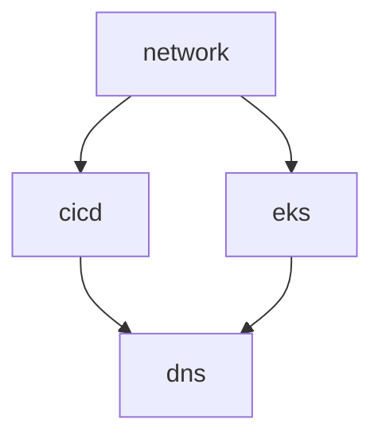

# 🏗️ AWS Infrastructure with Terraform

Multi-stack Terraform infrastructure for development and production environments.

## 📋 **Quick Start**

### **Prerequisites**
- Terraform ≥ 1.5
- AWS CLI v2 configured
- Access to S3 backend: `tfstate-inf-orinbar-euc1`

### **Deployment**
```bash
# Initialize all stacks
make init ENV=dev

# Deploy all stacks in order
make apply STACK=network ENV=dev
make apply STACK=cicd ENV=dev  
make apply STACK=dns ENV=dev
make apply STACK=eks ENV=dev

# Generate access guide and aliases
make access-guide
make ssm-aliases
source ~/.ssm-aliases
```

### **Destroy**
```bash
# Destroy in reverse order
make destroy STACK=eks ENV=dev
make destroy STACK=dns ENV=dev
make destroy STACK=cicd ENV=dev
make destroy STACK=network ENV=dev
```

---

## 🏗️ **Stack Overview**

### **1. Network** (`envs/dev/network/`)
- VPC with public/private subnets
- Custom NAT instance (cost-optimized)
- SSM access configuration
- Security groups

### **2. CICD** (`envs/dev/cicd/`)
- GitLab server (version control)
- Jenkins server (build automation)
- Jenkins agents (ephemeral builders)
- SSM-only access (no public IPs)

### **3. DNS** (`envs/dev/dns/`)
- Route53 public zone (delegated from Cloudflare)
  - Route53 private zone (`vpc.internal`)
- ACM certificate with DNS validation
- ExternalDNS IRSA role

### **4. EKS** (`envs/dev/eks/`)
- EKS cluster with managed node groups
- AWS Load Balancer Controller IRSA
- Public API (restricted IPs)
- Private worker nodes

---

## 🔐 **Access Patterns**

### **Quick Access (Using Aliases)**
```bash
# Generate aliases
make ssm-aliases
source ~/.ssm-aliases

# Use simple commands
gitlab-web        # Opens GitLab at http://localhost:8443
jenkins-web       # Opens Jenkins at http://localhost:8080
ssm-gitlab-shell  # SSH into GitLab server
ssm-jenkins-shell # SSH into Jenkins server
```

### **Manual SSM Port-Forward (if needed)**
```bash
# GitLab (localhost:8443)
aws ssm start-session --target <gitlab-instance-id> \
  --document-name AWS-StartPortForwardingSession \
  --parameters '{"portNumber":["80"],"localPortNumber":["8443"]}'

# Jenkins (localhost:8080)
aws ssm start-session --target <jenkins-instance-id> \
  --document-name AWS-StartPortForwardingSession \
  --parameters '{"portNumber":["8080"],"localPortNumber":["8080"]}'
```

### **Kubernetes Cluster**
```bash
# Update kubeconfig
aws eks update-kubeconfig --name proj-dev-cluster --region eu-central-1

# Or use terraform output
$(terraform -chdir=envs/dev/eks output -raw kubeconfig_command)
```

---

## 🌍 **Architecture**

```
Internet
    ↓
Cloudflare: infinity.ortflix.uk
    ↓ (NS delegation)
Route53: r53.infinity.ortflix.uk
    ↓ (ExternalDNS)
ALB → EKS Apps

Private Access:
Developer → SSM → GitLab/Jenkins (private subnets)
EKS Pods → Private DNS → gitlab-server.vpc.internal
```

**See [ARCHITECTURE.md](ARCHITECTURE.md) for detailed diagrams and explanations.**

---

## 📊 **Deployment Order**



**Dependencies:**
- `dns` requires `cicd` (for private IPs) and `eks` (for IRSA ARN)
- `cicd` and `eks` both require `network` (VPC, subnets)

---

## 🎯 **Key Features**

- ✅ **SSM-Only Access**: No bastion hosts or public IPs for CICD
- ✅ **Private DNS**: Clean hostnames (`gitlab-server.vpc.internal`)
- ✅ **Cost-Optimized**: Custom NAT instance (~$7/mo vs ~$45/mo)
- ✅ **Automated Certificates**: ACM + DNS validation
- ✅ **GitOps Ready**: ArgoCD uses private DNS for repository access
- ✅ **IRSA**: EKS service accounts with IAM roles

## 🔧 **Make Commands**

```bash
make init ENV=dev           # Initialize Terraform backend
make plan ENV=dev           # Plan changes
make apply ENV=dev          # Apply infrastructure
make destroy ENV=dev        # Destroy infrastructure
make output ENV=dev         # Show outputs
make validate ENV=dev       # Validate configurations
make fmt ENV=dev            # Format Terraform files

# New helper commands
make access-guide           # Generate INFRASTRUCTURE_ACCESS.md
make ssm-aliases            # Generate shell aliases for SSM
```

---

## 📚 **Documentation**

- **[INFRASTRUCTURE_ACCESS.md](INFRASTRUCTURE_ACCESS.md)**: Complete access guide (auto-generated)
- **[ARCHITECTURE.md](ARCHITECTURE.md)**: Detailed architecture overview
- **[K8S_INTEGRATION.md](K8S_INTEGRATION.md)**: Kubernetes manifests and setup
- **[Makefile](Makefile)**: Available commands

---

## 🔧 **Configuration**

### **Common Variables** (`envs/common.tfvars`)
```hcl
project_name  = "proj"
region        = "eu-central-1"
state_bucket  = "tfstate-inf-orinbar-euc1"
base_domain   = "infinity.ortflix.uk"
```

### **Environment Variables** (`envs/dev/dev-common.tfvars`)
```hcl
env = "dev"
```

### **Stack-Specific** (`envs/dev/<stack>/terraform.tfvars`)
- Network: VPC CIDR, NAT instance size
- CICD: Instance types, volume sizes
- EKS: Node count, instance types

---

## 🧪 **Testing**

### **Verify Network**
```bash
# Check NAT instance
aws ec2 describe-instances --filters "Name=tag:Name,Values=proj-nat"
```

### **Verify DNS**
```bash
# Check private DNS resolution from EKS
kubectl run test --image=busybox --rm -it -- \
  nslookup gitlab-server.vpc.internal
```

### **Verify Certificate**
```bash
# Check ACM certificate status
CERT_ARN=$(terraform -chdir=envs/dev/dns output -raw app_certificate_arn)
aws acm describe-certificate --certificate-arn "$CERT_ARN" \
  --query 'Certificate.Status' --output text
```

---

## 🚀 **Production Deployment**

Production environment structure is ready in `envs/prod/`. To populate:

1. Copy dev configurations to prod directories
2. Update CIDRs (use 20.10.x.x range)
3. Adjust instance sizes and counts
4. Deploy with `ENV=prod`

---

## 💡 **Troubleshooting**

### **Terraform State Issues**
```bash
# Re-initialize backend
make init ENV=dev

# Import existing resource
terraform import -var-file=../../common.tfvars \
  aws_key_pair.gen[0] proj-dev-key
```

### **SSM Session Not Working**
- Verify instance has SSM agent running
- Check IAM instance profile attached
- Verify security group allows outbound 443

### **DNS Not Resolving**
- Confirm private zone attached to VPC
- Check A records created with correct IPs
- Verify VPC DNS settings enabled

---

## 📝 **Maintenance**

- Update Terraform providers: `terraform init -upgrade`
- Rotate SSH keys: Regenerate via `keygen.tf`
- Update EKS version: Change `cluster_version` variable
- Certificate renewal: Automatic via ACM

---

**Status: Production Ready** ✅

For detailed architecture explanations, see [ARCHITECTURE.md](ARCHITECTURE.md).
